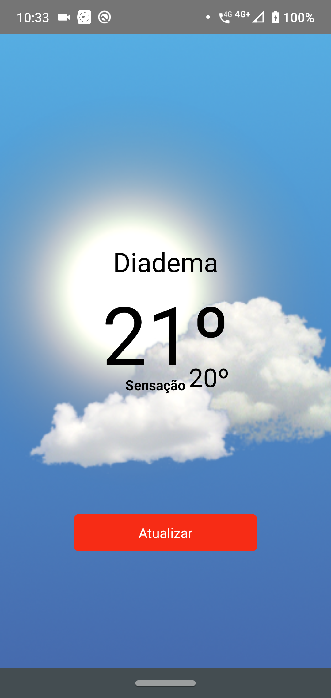

<h1 align="center">
  
</h1>


<h3 align="center">
  Clima tempo, aplicativo que demonstra sua localidade e a temperatura atual
</h3>


<h4 align="center"><strong>Instalação</strong></h4>
<h4 align="center"><strong>MOBILE</strong></h4>

>**SOMENTE ANDROID, não tenho MAC**

<ul>
  <li>Faça clone do projeto</li>
</ul>

1. Instalação de dependencias, após realizar o clone, siga os passos

```
yarn
```

Abra duas abas do terminal

2. Connecte o celular via usb liberando acesso para transmissão de arquivo por esta porta ou utilize um emulador de ANDROID. 

3. Rode o comando em uma aba do terminal

```
react-native start
```

4. Rode este outros comando em outra aba do terminal

```
$ adb reverse tcp:8081 tcp:8081

```

4.1. Caso utilize o genymotion rode

```
$ adb connect IP_DO_SEU_EMULADOR:5555
```

5. Rode o comando para instalar no aparelho / emulador

```
$ react-native run-android
